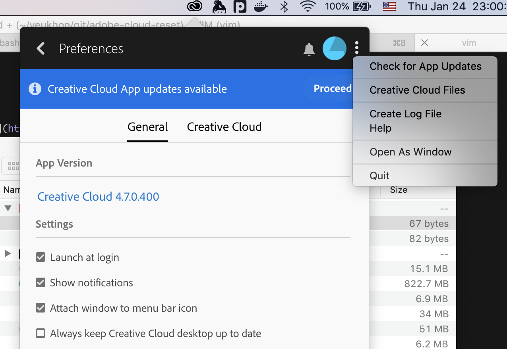
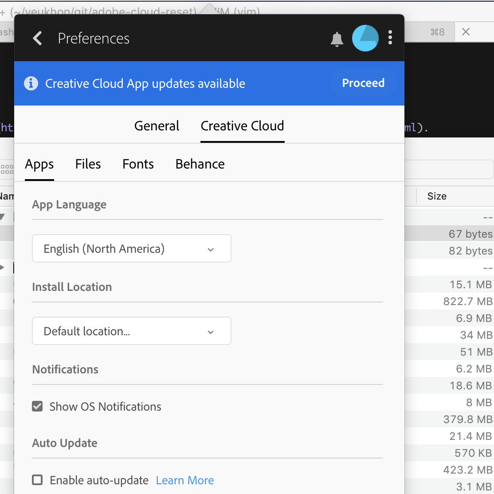

# adobe-cloud-reset
Reset Adobe Cloud Trials (Photoshop, After Effects, Illustrator, etc)

## Installation

1. Uninstall existing Adobe softwares (e.g. Photoshop). Download installers from [here](https://prodesigntools.com/adobe-cc-2018-direct-download-links.html).

2. Disable Creative Cloud auto update (and never update!)

3. Quit Creative Cloud.

4. Download the latest version from apps/.

5. Unzip.

6. Launch the application.

Optionally, you can drag and drop the application to the Applications folder.

# Screenshot

